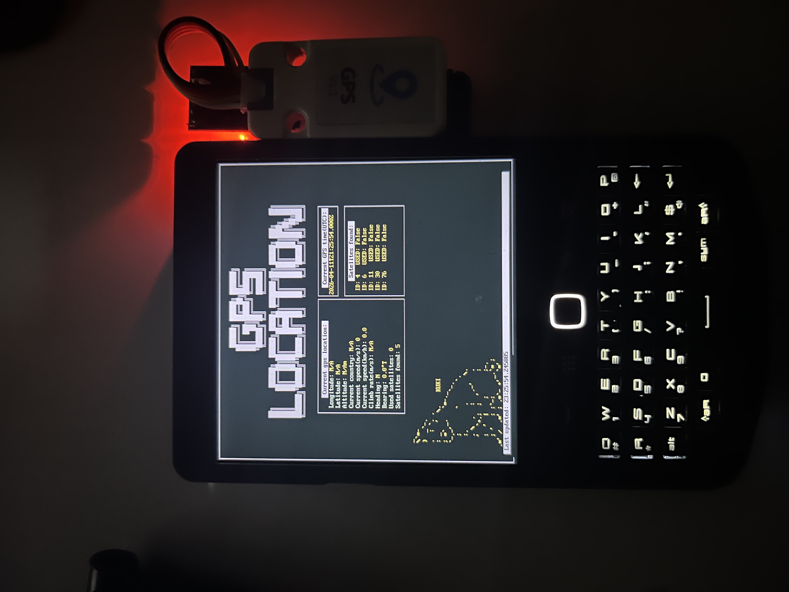

# GPS APP FOR TERMINAL IN PYTHON

The app was basically made for my hackberry and was not tested for other devices, but probably this code works for every system that will run gpsd(GPS daemon). Basically all unix based systems Mac, Linux, Free BSD. Please notify me for any issues of bugs to fix or maybe even features to add ;)



# USAGE
You have to have gps daemon installed(gpsd)
```bash
sudo apt install gpsd gpsd-clients # for debian/ubuntu
sudo pacman -Syu gpsd gpsd-clients # for arch
```
You have to have GPSd module for python installed
```bash
pip install gps
#or
pip3 install gps
```
To run you just use:
```bash
python3 Country.py # or whatever you save this file as
```

# WHAT'S WITH THE CAT?
Thats my cat Kuki if you don't like him just download the version without him<br>
Here is his photo<br>


# WHY DID I MAKE THIS?
I wanted to have a nice GPS app for my Hackberry Pi Zero